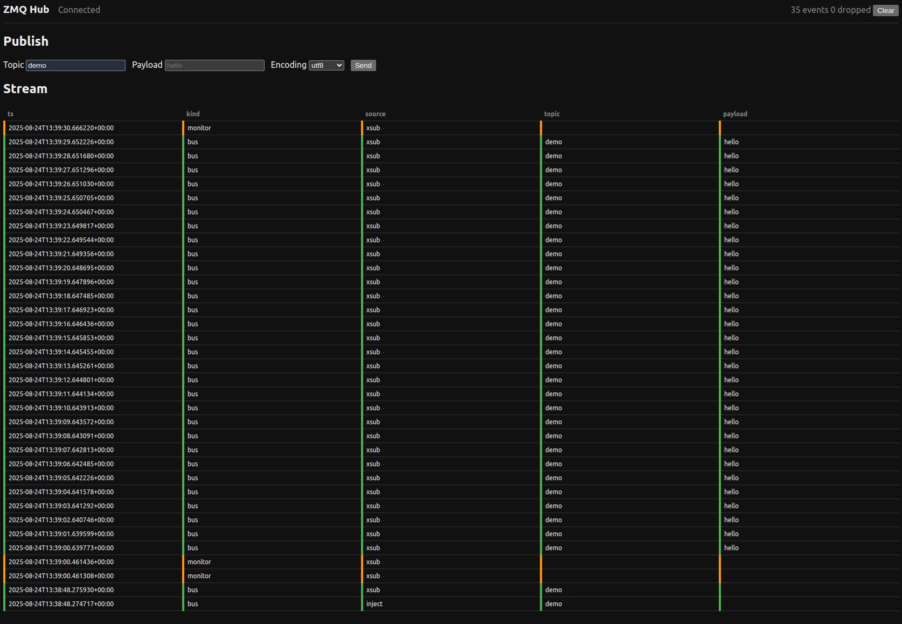

# ZMQ Hub

ZeroMQ hub with a browser UI. It runs an XSUB/XPUB proxy, captures monitor events and bus messages, and streams them to the browser over WebSockets. The UI can also publish messages back onto the bus.



## Features (MVP)
- XSUB bind (publishers connect) and XPUB bind (subscribers connect).
- Monitor events streamed live to the browser.
- Bus messages (topic + payload) streamed live to the browser.
- Browser-originated publish via WebSocket control channel.

## Install

Use a virtualenv and install deps:

```
python -m venv .venv && . .venv/bin/activate
pip install -r requirements.txt
```

## Run

Start the HTTP/WS server (defaults: 0.0.0.0:8080):

```
uvicorn backend.app:app --host 0.0.0.0 --port 8080 --reload
```

Open the UI at http://localhost:8080/

The hub will listen for:
- XSUB (publishers): tcp://0.0.0.0:5551
- XPUB (subscribers): tcp://0.0.0.0:5552

## Try it

Terminal 1: run the hub (above).

Terminal 2: start a sample publisher:

```
python examples/pub.py demo "hello"
```

Terminal 3: start a sample subscriber:

```
python examples/sub.py demo
```

You should see messages flowing in the browser under “Stream”.

## Configuration

Environment variables (defaults in parentheses):

- ZMQHUB_HTTP_HOST (0.0.0.0)
- ZMQHUB_HTTP_PORT (8080)
- ZMQHUB_XSUB_BIND (tcp://0.0.0.0:5551)
- ZMQHUB_XPUB_BIND (tcp://0.0.0.0:5552)
- ZMQHUB_INJECT_CONNECT (tcp://127.0.0.1:5551)
- ZMQHUB_CORS_ORIGINS (["*"])
- ZMQHUB_CLIENT_QUEUE_SIZE (1000)
- ZMQHUB_LINGER_MS (0)
- ZMQHUB_LOG_LEVEL (INFO)

Create a `.env` file if desired; settings are parsed at startup.

## Notes

- This is a basic MVP: filters, ACLs, metrics, rate-limiting, and persistence are not yet implemented.
- For production, consider TLS termination for HTTP/WS and CURVE/TLS for ZMQ sockets.
